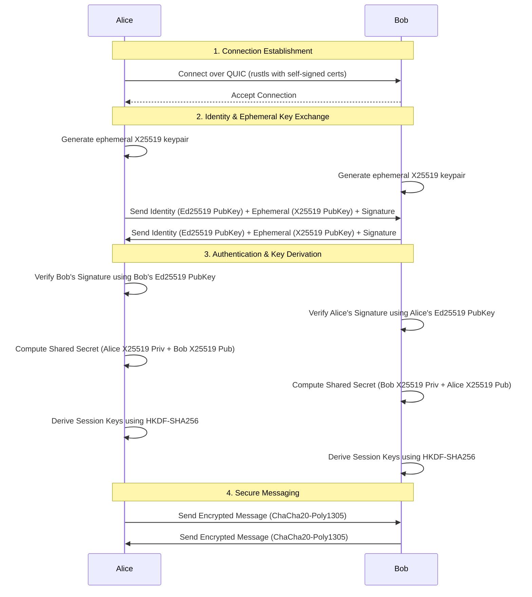

# Peer-to-Peer Encrypted Chat

A fully decentralized, production-grade, end-to-end encrypted (E2EE) peer-to-peer chat application built in Rust.

## Architecture Guidelines

- **No Central Server**: Pure P2P architecture. Nodes interact directly with each other.
- **Secure by Default**: All connections are mutually authenticated and encrypted.
- **Transport**: `quinn` for multiplexed, reliable streams via QUIC (over UDP).
- **Cryptography**: Ed25519 for persistent identity and signatures, X25519 for Diffie-Hellman ephemeral key exchange, HKDF for session key derivation, and ChaCha20-Poly1305 for authenticated symmetric encryption.

## Connection Handshake Sequence

The protocol establishes a secure session between two peers using a custom cryptographic handshake over QUIC.



## Threat Model & Security Considerations

1. **Eavesdropping (Passive Attacker)**: Mitigated. All traffic is encrypted using ChaCha20-Poly1305. The Diffie-Hellman exchange ensures an attacker cannot read messages even if they monitor the network.
2. **Man-in-the-Middle (Active Attacker)**: Mitigated. The ephemeral key exchange parameters are signed by the persistent `Ed25519` identity keys. An attacker cannot forge these signatures without the private identity key.
3. **Replay Attacks**: Mitigated. The QUIC transport handles basic sequence numbers and anti-replay, and the application protocol includes nonces and timestamps in the signed/encrypted payload.
4. **Forward Secrecy**: Achieved. Ephemeral `X25519` keys are generated per-session. Compromise of the long-term `Ed25519` identity key does not compromise past session traffic.

## Project Structure

- `src/main.rs`: Application entry point and CLI parsing.
- `src/crypto/`: Identity generation, signing, key exchange, and encryption routines.
- `src/network/`: QUIC connection establishment and stream management.
- `src/protocol/`: Message serialization, deserialization, and framing.
- `src/discovery/`: Peer discovery mechanisms (Manual IP, mDNS).

## Running the Application

This is a pure peer-to-peer chat application. To chat, you need at least two running nodes.

### Local Network (Auto-Discovery)
If both computers are on the same Wi-Fi or local network, the built-in `mDNS` module will automatically discover and connect them.

**Terminal 1:**
```bash
# Start your node on a specific port
cargo run --release -- --port 61899
```

**Terminal 2:**
```bash
# Start the second node on a different port
cargo run --release -- --port 61900
```
*(They will automatically find each other and establish a secure, encrypted session!)*

### Over the Internet (Manual Connect)
If you are chatting with someone on a completely different network (e.g., across the internet), one of you must be reachable via a public IP address or a Virtual LAN (like Tailscale, ZeroTier, or Hamachi).

**Host Node:**
```bash
cargo run --release -- --port 61899
```

**Connecting Node:**
```bash
# Connect directly to the Host's IP address and Port
cargo run --release -- --port 61900 --connect <HOST_IP>:61899
```
